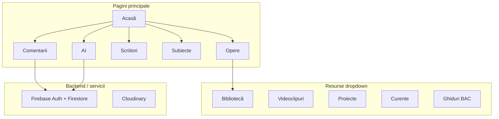

# Plan de prezentare – Comentarii de BAC

## Context

**Comentarii de BAC** este o platformă web educațională pentru pregătirea la examenul de bacalaureat la limba și literatura română. A fost creată de doi elevi și un profesor, cu resurse structurate, moderne și ușor de parcurs.

**Stack tehnic:** React 19 + Vite, Firebase (auth, Firestore), Cloudinary, SASS, React Router.

---

## Structura prezentării (estimativ 15–25 min)

### 1. Introducere (2–3 min)

- **Mesaj de deschidere:** „Platforma ta pentru comentarii, resurse și inspirații de BAC”
- **Public țintă:** elevi care se pregătesc pentru BAC la limba română
- **Origine:** colaborare elevi + profesor
- **Demo:** pagina principală ([`src/pages/index.jsx`](src/pages/index.jsx)) – hero cu titlu animat, ScriitoriHoraCanvas

---

### 2. Navigare și structură (2 min)

- **Navbar** ([`src/assets/Navbar.jsx`](src/assets/Navbar.jsx)): Acasă, Opere, Comentarii, Scriitori, Resurse (dropdown), Subiecte, AI
- **Tema:** light/dark mode
- **Autentificare:** login pentru profil și comentarii personale

---

### 3. Secțiuni principale (10–15 min)

#### 3.1 Opere și Biblioteca

- **Opere** (`/opere`): listă opere canonice (Harap-Alb, Moara cu noroc, Ion, Enigma Otiliei, Luceafărul, Plumb etc.)
- **Pagina Opera** (`/opera/:slug`): detalii opera, teme, personaje
- **Biblioteca** (`/biblioteca`): opere cu cititor integrat (`/carte/*`) – ex. Harap-Alb, Moara cu noroc, Ion, Enigma Otiliei, Luceafărul, Plumb

**Demo:** deschide o operă și arată cititorul de carte.

#### 3.2 Scriitori

- **Scriitori** (`/scriitori`): listă autori cu imagini
- **Scriitor** (`/scriitor?name=...`): pagină individuală cu biografie, opere, chat interactiv (ScriitorChat)

**Demo:** scriitor individual cu chat.

#### 3.3 Comentarii

- **Comentarii** (`/comentarii`): comentarii literare cu filtre pe categorie (poezie, roman, comedie, basm, nuvelă etc.)
- **Firebase:** comentarii stocate în cloud
- **Profil:** comentarii personale, partajare (`/comentarii/share/:shareId`)
- **Export PDF:** html2pdf.js

**Demo:** filtrare comentarii, vizualizare comentariu, opțiune de partajare.

#### 3.4 Subiecte și Ghiduri BAC

- **Subiecte** (`/subiecte`): Subiect I, II, III cu cerințe
- **Ghiduri** (`/ghiduri`, `/subiecte/ghid-subiect-1`, etc.):
  - Subiect I: subpuncte A și B
  - Subiect II: naratorul, notațiile autorului, semnificația lirică
  - Subiect III: structură, planuri, cerințe

**Demo:** un ghid complet (ex. Ghid Subiect II – Naratorul).

#### 3.5 Resurse (dropdown)

- **Bibliotecă** – deja prezentată
- **Videoclipuri** (`/videoclipuri`): filme YouTube ale operelor (Harap-Alb, Moara cu noroc, Ion, Enigma Otiliei, Baltagul etc.)
- **Proiecte** (`/proiecte`): proiecte ale colegilor – site-uri (Romantismul, Simbolismul, Harap-Alb), prezentări Google Slides (Originile Române, Revoluția 1848, Literatura română)
- **Curente** (`/curente`): roată interactivă CurenteWheel pentru curente literare
- **Ghiduri BAC** – deja prezentate

**Demo:** roata curentelor, deschidere proiect (site sau prezentare embedded).

#### 3.6 AI

- **AI** (`/ai`): asistent pentru BAC
  - Rezolvare subiecte cu AI
  - Generare comentarii
  - Procesare cerințe (AICerinteProcessor)
  - Comentarii din imagini (AICommentsFromImages)
  - Formatare și feedback cu rubrică (puncte obținute/maxime)

**Demo:** rezolvare unui subiect sau generare comentariu.

---

### 4. Funcționalități tehnice (2–3 min)

- **Firebase:** autentificare, comentarii, profil, notificări
- **Cloudinary:** imagini profil
- **Responsive:** navbar cu meniu mobil
- **Accesibilitate:** ARIA, tema dark/light

---

### 5. Despre Noi și încheiere (1–2 min)

- **Despre Noi** (în Footer): povestea proiectului – elevi + profesor
- **Mesaj final:** „Succes la BAC!”

---

## Diagramă – Arhitectura site-ului

---

## Recomandări pentru prezentare

1. **Pregătire:** deschide site-ul în tab-uri pentru Opera, Comentarii, AI, Curente – schimbă rapid între ele.
2. **Ordine:** urmează fluxul natural al unui elev: Opere → Comentarii → Subiecte → Ghiduri → AI.
3. **Demo AI:** cel mai impactant – arată generarea/rezolvarea cu AI.
4. **Proiecte:** evidențiază colaborarea – proiecte ale colegilor integrate în platformă.
5. **Tema:** arată switch-ul dark/light pentru design modern.

---

## Checklist înainte de prezentare
- [ ] Site rulat local (`npm run dev`) sau pe hosting
- [ ] Cont de test pentru login
- [ ] Conexiune Firebase activă
- [ ] Câteva comentarii și opere populate
- [ ] Rezolvare AI funcțională (API keys configurate)
